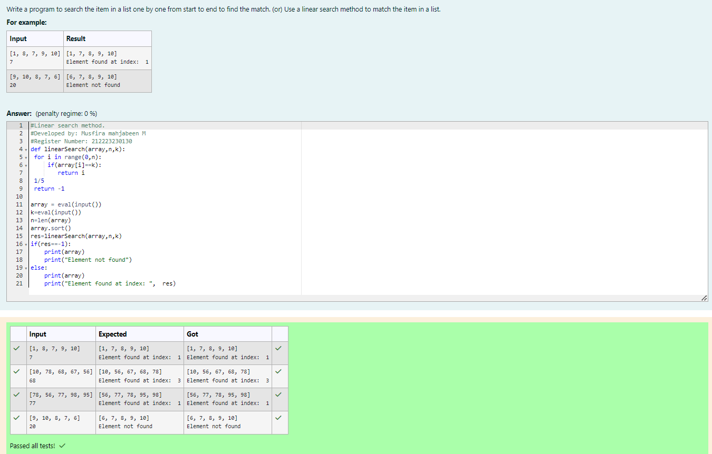
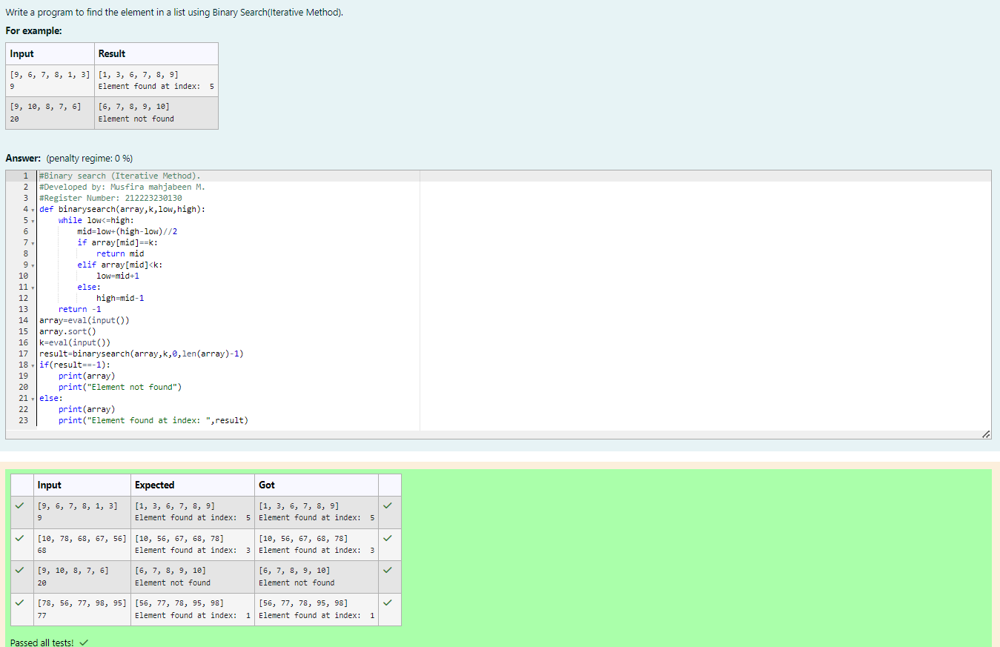
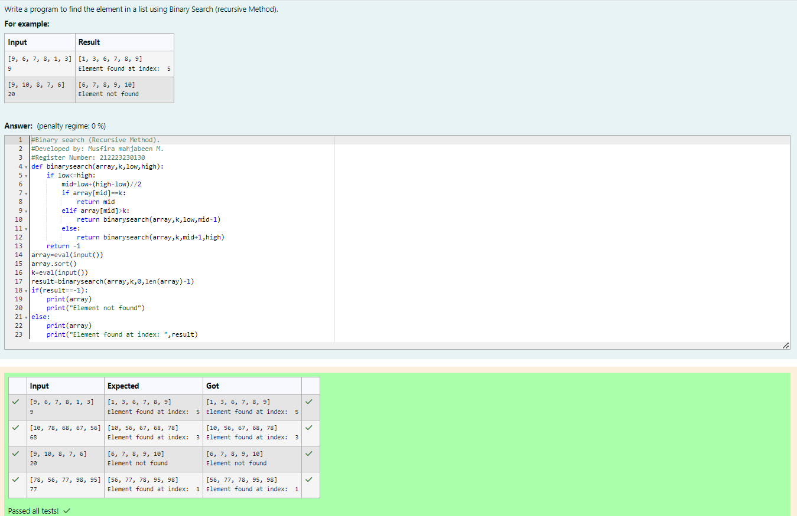

# Linear Search and Binary search
## Aim:
To write a program to perform linear search and binary search using python programming.
## Equipment’s required:
1.	Hardware – PCs
2.	Anaconda – Python 3.7 Installation / Moodle-Code Runner
## Algorithm:
## Linear Search:
1.	Start from the leftmost element of array[] and compare k with each element of array[] one by one.
2.	If k matches with an element in array[] , return the index.
3.	If k doesn’t match with any of elements in array[], return -1 or element not found.
## Binary Search:
1.	Set two pointers low and high at the lowest and the highest positions respectively.
2.	Find the middle element mid of the array ie. arr[(low + high)/2]
3.	If x == mid, then return mid.Else, compare the element to be searched with m.
4.	If x > mid, compare x with the middle element of the elements on the right side of mid. This is done by setting low to low = mid + 1.
5.	Else, compare x with the middle element of the elements on the left side of mid. This is done by setting high to high = mid - 1.
6.	Repeat steps 2 to 5 until low meets high
## Program:
i)	#Use a linear search method to match the item in a list.
```python
# Linear search method.
# Developed by: Musfira mahjabeen M
# Register Number: 212223230130
def linearSearch(array,n,k):
 for i in range(0,n):
     if(array[i]==k):
        return i
 1/5
 return -1
    
array = eval(input())
k=eval(input())
n=len(array)
array.sort()
res=linearSearch(array,n,k)
if(res==-1):
    print(array)
    print("Element not found")
else:
    print(array)
    print("Element found at index: ",  res)


```
ii)	# Find the element in a list using Binary Search(Iterative Method).
```python
# Binary search (Iterative Method).
# Developed by: Musfira mahjabeen M.
# Register Number: 212223230130
def binarysearch(array,k,low,high):
    while low<=high:
        mid=low+(high-low)//2
        if array[mid]==k:
            return mid
        elif array[mid]<k:
            low=mid+1
        else:
            high=mid-1
    return -1
array=eval(input())
array.sort()
k=eval(input())
result=binarysearch(array,k,0,len(array)-1)
if(result==-1):
    print(array)
    print("Element not found")
else:
    print(array)
    print("Element found at index: ",result)


```
iii)	# Find the element in a list using Binary Search (recursive Method).
```python
# Binary search (Recursive Method).
# Developed by: Musfira mahjabeen M.
# Register Number: 212223230130
def binarysearch(array,k,low,high):
    if low<=high:
        mid=low+(high-low)//2
        if array[mid]==k:
            return mid
        elif array[mid]>k:
            return binarysearch(array,k,low,mid-1)
        else:
            return binarysearch(array,k,mid+1,high)
    return -1
array=eval(input())
array.sort()
k=eval(input())
result=binarysearch(array,k,0,len(array)-1)
if(result==-1):
    print(array)
    print("Element not found")
else:
    print(array)
    print("Element found at index: ",result)


```
## Sample Input and Output

i)	#Use a linear search method to match the item in a list.


ii)	# Find the element in a list using Binary Search(Iterative Method).



iii)	# Find the element in a list using Binary Search (recursive Method).


## Result
Thus the linear search and binary search algorithm is implemented using python programming.
